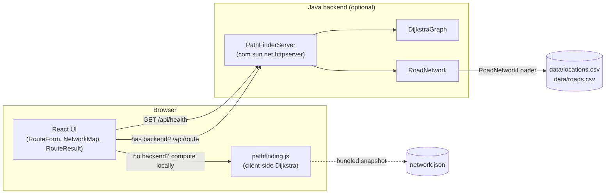
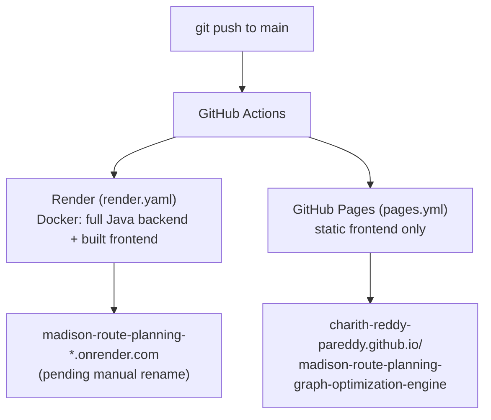

# Madison Route Planning & Graph Optimization Engine

[](https://github.com/Charith-Reddy-Pareddy/madison-route-planning-graph-optimization-engine/actions/workflows/ci.yml)

**Live:** [GitHub Pages](https://charith-reddy-pareddy.github.io/madison-route-planning-graph-optimization-engine/) · [Render](https://path-finder-nbjl.onrender.com) (full Java backend; free-tier instance may take ~30-50s to wake up if idle -- Render URL pending rename, see note below)

A full-stack route-planning app for UW-Madison and downtown Madison, WI:
pick a start and end location and get the shortest route via Dijkstra's
algorithm, with estimated walk time and which Madison Metro Transit bus
(if any) covers each leg.

**Highlights**

- **57 real locations, geocoded, not guessed** — every coordinate comes
  from [OpenStreetMap's Nominatim](https://nominatim.openstreetmap.org/),
  and geocoding caught two real placement errors an earlier hand-estimated
  pass got wrong (see [Where the coordinates come from](#where-the-coordinates-come-from)).
- **A real Dijkstra implementation, since improved past its coursework
  form** — the engine started as a UW-Madison CS400 assignment; this repo
  wraps it in a real backend/frontend and has since fixed a real
  inefficiency in it (see [Project history](#project-history)).
- **Two live deployments from one codebase** — a full Java backend
  (Render) and a static build with a client-side pathfinding fallback
  (GitHub Pages), so the app works identically with or without a server.
- **A hand-built SVG map with no mapping library** — pan, zoom, pinch-to-
  zoom, collision-avoiding labels, and lake-avoiding road routing, all
  custom (see [The network map](#the-network-map)).
- **55+ tests across both layers** — JUnit integration tests that drive
  the real HTTP server, plus Vitest tests including a randomized
  correctness check between two independent pathfinding implementations.

## Architecture



## Tech stack

| Layer | Tech |
|---|---|
| Graph engine | Java 21 — generic `DijkstraGraph<NodeType, EdgeType>` over a custom hash-map ADT |
| Backend | Java's built-in `com.sun.net.httpserver` (no framework), plain JSON over HTTP |
| Frontend | React 19 + Vite — no map library; the network map is a hand-built inline SVG component ([frontend/src/components/NetworkMap.jsx](frontend/src/components/NetworkMap.jsx), see below) |
| Testing | JUnit 5 (backend) + Vitest/React Testing Library (frontend) |
| Build | `make` — compiles Java, builds the React frontend, downloads the JUnit console launcher, runs tests, runs the app |

## Project history

`DijkstraGraph.java`'s `computeShortestPath` (the CS400 header at the top
of that file is the original assignment's required format) started as a
UW-Madison CS400 (data structures) assignment implementing a generic
weighted directed graph, based on the course's own lecture pseudocode for
Dijkstra's algorithm. Everything else — the HTTP backend, the road
network and its real geocoded data, the React/SVG frontend, both
deployments, and all 55+ tests — was built afterward, on top of that
graph engine, to turn it into an actual route planner instead of a test
fixture.

The algorithm itself has also been improved past its original coursework
form: the original version enqueued a new search candidate for every edge
out of a visited node unconditionally, even when a cheaper path to that
same node was already known, relying on a later visited-set check to
discard the loser once it was popped back out. It now tracks a best-known
distance per node and only enqueues strict improvements, so an inferior
candidate is never queued in the first place — see
`lastEdgesConsidered()`/`lastQueueInsertions()` on `DijkstraGraph` and
`DijkstraGraphTest#trackingBestKnownDistancePrunesInferiorQueueInsertions`
for a test that demonstrates the pruning on a graph engineered to have
redundant paths. The GitHub Pages client-side fallback (`pathfinding.js`)
had the same class of fix: its min-selection was a linear scan over every
unvisited node each round (O(V² + E)); it's now a binary min-heap — see
`frontend/scripts/benchmark-pathfinding.mjs` for a real timing comparison
between the two (at 5,000 random nodes, the heap ran ~89x faster, with
identical path costs).

## Research track

Alongside the live 57-location app above, [`pipeline/`](pipeline/) ingests
the real OpenStreetMap street network for the same Madison/UW-Madison
area into a full-scale routable graph -- a genuinely large, real dataset
to build and benchmark additional pathfinding algorithms against, kept
entirely separate from what the deployed app serves (see
[pipeline/README.md](pipeline/README.md) for the fetch → parse → build
pipeline itself). Real, most recent run:

| | |
|---|---|
| Source | Overpass API (`overpass.kumi.systems`), bbox matching the live network's own extent |
| Locations | 40,883 real intersections/endpoints |
| Roads | 120,370 directed edges, real haversine distances |
| Connectivity | 99.26% of nodes in one connected component (92 total; the rest are small fragments where the bounding box cuts through a road) |
| Real tag coverage | 848 edges carry a real `incline` value, 3,434 carry `sidewalk` info -- genuine OpenStreetMap accessibility data, not synthesized |

Reproduce it: `python3 pipeline/build_graph.py`, then
`python3 scripts/validate_network.py` to check it (dangling-edge and
connected-component checks -- see that script for why an every-pair test
like `RoadNetworkTest.java` doesn't scale to a graph this size).

## Where the coordinates come from

Every location's lat/lon is a real geocoded point, not hand-estimated --
each was looked up individually via [OpenStreetMap's Nominatim](https://nominatim.openstreetmap.org/)
(free, no API key) against its actual name or street address, and each
road's `miles` is the real great-circle distance between those two points,
not a guess. An earlier pass of this data was hand-estimated from memory
and got some relative distances wrong (e.g. placing Dejope Residence Hall,
which is actually out near Eagle Heights on the far west side, close to
X01 near Kohl Center on the other side of campus) -- geocoding caught and
fixed that, and also caught a wrong assumption that Witte/Sellery/Ogg were
Lakeshore dorms (they're actually the Southeast dorms, on W Johnson/Dayton
St; the real Lakeshore corridor along Observatory Dr that Route 80 runs is
Elizabeth Waters/Slichter/Kronshage/Bradley/Dejope). Nominatim doesn't
always resolve a street *intersection* precisely (e.g. "State St & Gilman
St" can land at some other point along State St rather than exactly that
corner), so a few points are approximate to a block or so -- but every
point is real data, not invented, and every distance is computed from it.
Full provenance, the CSV schema (each location's real geocode `query`,
`source`, and `retrieved_at`), and how to reproduce or re-verify any of
it with [`scripts/geocode.py`](scripts/geocode.py) are in
[data/sources.md](data/sources.md).

Shortest-path correctness is verified the same way, not just assumed:
every ordered pair of the network's 57 locations (3,192 total) was
cross-checked against an independent reference Dijkstra implementation,
for both the Java backend and the separate client-side JS fallback --
3,192/3,192 matched on both.

## The network map

No mapping library (no Leaflet/Mapbox/Google Maps) — `NetworkMap.jsx` is
plain SVG, built up in a few layers:

- **Projection**: each location's real lat/lon is linearly projected onto
  the SVG viewBox (`project()`).
- **Decluttering**: real campus buildings sit only blocks apart, which a
  straight projection crushes together. `declump()` runs an iterative
  repulsion pass that nudges any two nodes closer than a minimum pixel
  distance apart, leaving already-separated nodes untouched — a
  simplified force-directed layout, computed once and memoized.
- **Label placement**: `layoutLabels()` greedily places each name, skipping
  it if its estimated bounding box would collide with an already-placed
  label (the current route's stops always win). Isolated locations stay
  labeled at any zoom; only genuinely crowded clusters thin out.
- **Pan/zoom**: an SVG `<g transform="translate(...) scale(...)">` driven
  by hand-wired wheel, pointer-drag, and two-finger pinch handlers (a real
  `wheel` listener via `useEffect`, since React's synthetic one is passive
  and can't call `preventDefault`).
- **Lakes**: Mendota and Monona are hand-picked lat/lon polygons run
  through the same projection, sized to fit inside canvas margin reserved
  specifically for them (`NORTH_WATER_MARGIN`/`SOUTH_WATER_MARGIN`), and
  rendered as filled `<path>`s behind everything else.
- **Routes**: drawn as SVG `<line>`s between projected positions; one-way
  streets get an arrowhead via an SVG `<marker>`; the current route
  animates in with a CSS `stroke-dashoffset` transition.

## Deployment



> **Note:** the repo was renamed from `path-finder` to
> `madison-route-planning-graph-optimization-engine` and the Render service
> in [render.yaml](render.yaml) from `path-finder` to
> `madison-route-planning`. GitHub Pages' URL updates automatically to
> match the repo name; Render's live URL only updates once the service is
> also renamed in the Render dashboard (Settings → Name) -- `render.yaml`
> alone doesn't trigger that on an existing deployment. Until that's done,
> the live Render link above still points at the old URL.

Ships two ways, from the same frontend build:

- **Render** ([render.yaml](render.yaml), a Blueprint): the full app —
  Docker image (multi-stage: builds the React frontend, compiles the Java
  backend, then a slim JRE runtime) reading its port from `PORT`, so it
  also runs as-is on Cloud Run, Fly, or any container platform. Redeploys
  on every push to `main`.
- **GitHub Pages** ([.github/workflows/pages.yml](.github/workflows/pages.yml)):
  the frontend alone, with no Java backend at all. `frontend/src/api.js`
  probes for a live backend on load and, when there isn't one, falls back
  to a bundled snapshot of the network ([frontend/src/data/network.json](frontend/src/data/network.json))
  plus a client-side Dijkstra port ([frontend/src/pathfinding.js](frontend/src/pathfinding.js)) —
  same shortest-path results, same bus/time estimates, entirely in the
  browser. Also redeploys on every push to `main`.

`network.json` is a point-in-time snapshot of `/api/graph`, not generated
at build time — if `RoadNetwork.java` changes, re-export it (`curl
localhost:8080/api/graph | python3 -m json.tool > frontend/src/data/network.json`
with `make run` going) so the two stay in sync. A test
(`pathfinding.test.js`) pins one known route's cost against the snapshot
to catch drift.

## Running it

Requires a JDK (21+), Node.js, and `make`.

```bash
make run
```

Then open [http://localhost:8080](http://localhost:8080). Pick a start
and end intersection and click **Find shortest route** — the map
highlights the path and the panel lists each leg's distance.

Port is configurable via `PORT` (defaults to 8080):

```bash
PORT=9000 make run
```

For frontend-only work with hot reload (proxying API calls to a
separately-running backend), see [frontend/README.md](frontend/README.md).

## Testing

```bash
make test
```

Runs both suites (55+ tests). Backend: `javac`s the Java sources,
downloads the JUnit Platform Console Standalone launcher into `lib/` on
first run (cached after that), and runs unit tests for `DijkstraGraph`,
a `RoadNetworkTest` that checks every location can reach every other one
(catches a one-way street accidentally stranding a node), plus
integration tests that start the real server on an ephemeral port and
drive it over real HTTP with `java.net.http.HttpClient` — status codes,
response shape, cache headers, that a burst of concurrent requests
doesn't serialize, and that the HTTP layer's answer matches calling the
graph directly. Frontend: Vitest + React Testing Library, covering
`RouteForm`, `NetworkMap` (including the label-collision layout and
pinch/drag pan-zoom math), `api.js` (including its no-backend fallback),
`pathfinding.js` (the client-side Dijkstra port, incl. a parity check
against the backend's pinned test case and a randomized correctness check
against a plain linear-scan reference implementation), and the
`ErrorBoundary`.

## Project layout

```
data/
  locations.csv, roads.csv          the network's raw data, loaded by RoadNetworkLoader
  sources.md                        where every coordinate and distance comes from
src/
  MapADT.java, PlaceholderMap.java   generic key/value map ADT (hash map backed)
  GraphADT.java, BaseGraph.java      generic directed weighted graph
  DijkstraGraph.java                 shortest-path algorithm (priority-queue Dijkstra)
  RoadNetwork.java                   the 57-location network: intersections, roads, bus routes, one-ways
  RoadNetworkLoader.java             reads data/locations.csv + data/roads.csv into RoadNetwork
  PathFinderServer.java              HTTP API + static file server
  Json.java                          minimal hand-rolled JSON response writer
  Main.java                          entry point
test/
  DijkstraGraphTest.java             algorithm unit tests
  RoadNetworkTest.java               network sanity checks (every location reachable, no dangling roads)
  RoadNetworkLoaderTest.java         CSV parsing, incl. quoted commas in locations.csv's query column
  PathFinderServerIntegrationTest.java  end-to-end HTTP integration tests
  JsonTest.java                      JSON writer unit tests
frontend/
  src/
    components/NetworkMap.jsx         the hand-built SVG map (see "The network map" above)
    components/RouteForm.jsx, RouteResult.jsx, ErrorBoundary.jsx
    api.js                            fetches the live backend, or falls back to client-side computation
    pathfinding.js                    client-side Dijkstra port (binary min-heap), used when there's no backend (GitHub Pages)
    data/network.json                 point-in-time snapshot of /api/graph, powers that fallback
  scripts/benchmark-pathfinding.mjs   heap vs. linear-scan timing comparison (`node scripts/benchmark-pathfinding.mjs`)
  (see frontend/README.md for frontend-only dev setup)
web/                                  generated by `make frontend` (gitignored) — Vite's build output, served by PathFinderServer
pipeline/                             research track: real OSM ingestion (see "Research track" above, pipeline/README.md)
  fetch_osm.py, parse_osm.py, build_graph.py
experiments/data/                     pipeline's output: osm_locations.csv, osm_roads.csv (committed; pipeline/data/ raw/intermediate files are not)
scripts/
  validate_network.py                 connectivity/integrity checks for a graph the size of the OSM dataset
  geocode.py                          reusable Nominatim lookup + batch re-verification (see data/sources.md)
.github/workflows/
  ci.yml                              runs `make test` on push/PR
  pages.yml                           builds the frontend and deploys it to GitHub Pages on push to main
Makefile
LICENSE                              MIT
```

## API

- `GET /api/graph` — all locations (id, name, lat/lon) and roads (from,
  to, miles, and `busRoute` — the real Metro Transit route that road is
  on, or `null` for a walk-only segment), for rendering the map.
- `GET /api/route?start=<id>&end=<id>` — shortest path, with each leg's
  distance, walking-pace minutes, and `busRoute`, plus totals. Returns
  `404` if either id is unknown or no path exists, `400` if a parameter
  is missing. (Bus route legs get grouped into ride-able trips and their
  own time estimate client-side — see `RouteResult.jsx`.)
- `GET /api/health` — liveness check, used by Render's health check.

The server handles each request on its own virtual thread
(`Executors.newVirtualThreadPerTaskExecutor()`) rather than the JDK
default of one request at a time.

## The algorithm

`DijkstraGraph.computeShortestPath` runs Dijkstra's algorithm with a
`java.util.PriorityQueue` of partial paths ordered by cost so far,
expanding the lowest-cost frontier node first and stopping as soon as
the destination is popped. `RoadNetwork` includes a few one-way streets
specifically so the shortest path can differ depending on direction of
travel — a plain undirected shortest-path search wouldn't reproduce it.

It also tracks a best-known distance per node so it only enqueues a
candidate path when that path is a strict improvement over the best one
already found to that node — see [Project history](#project-history) for
why that matters and how it's tested.

